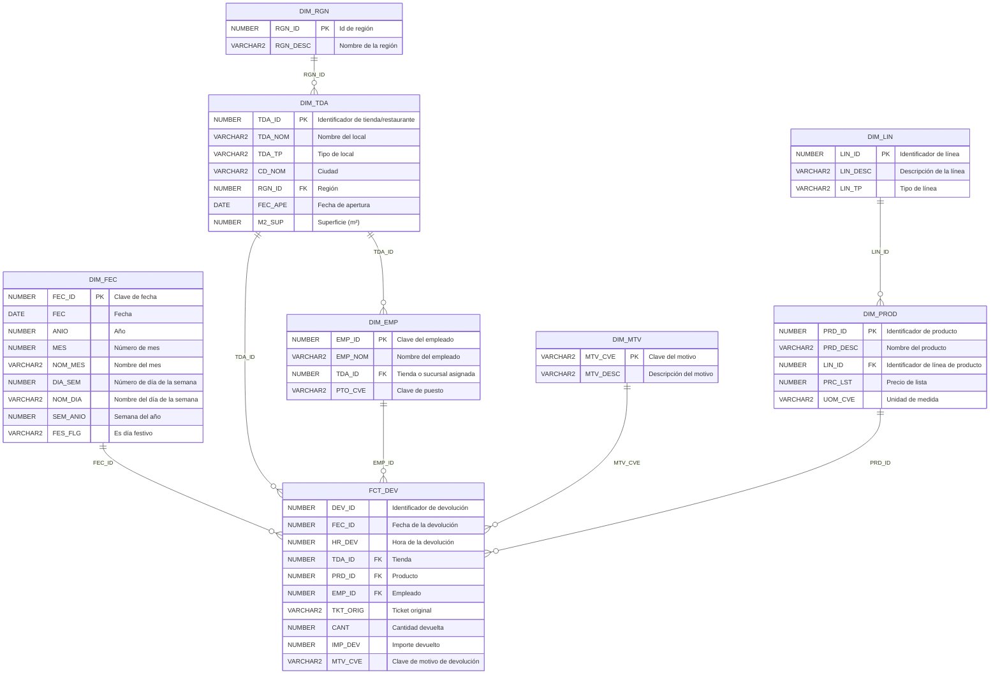
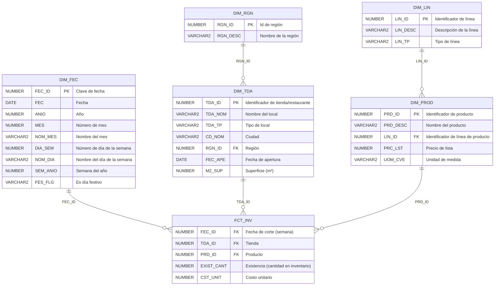
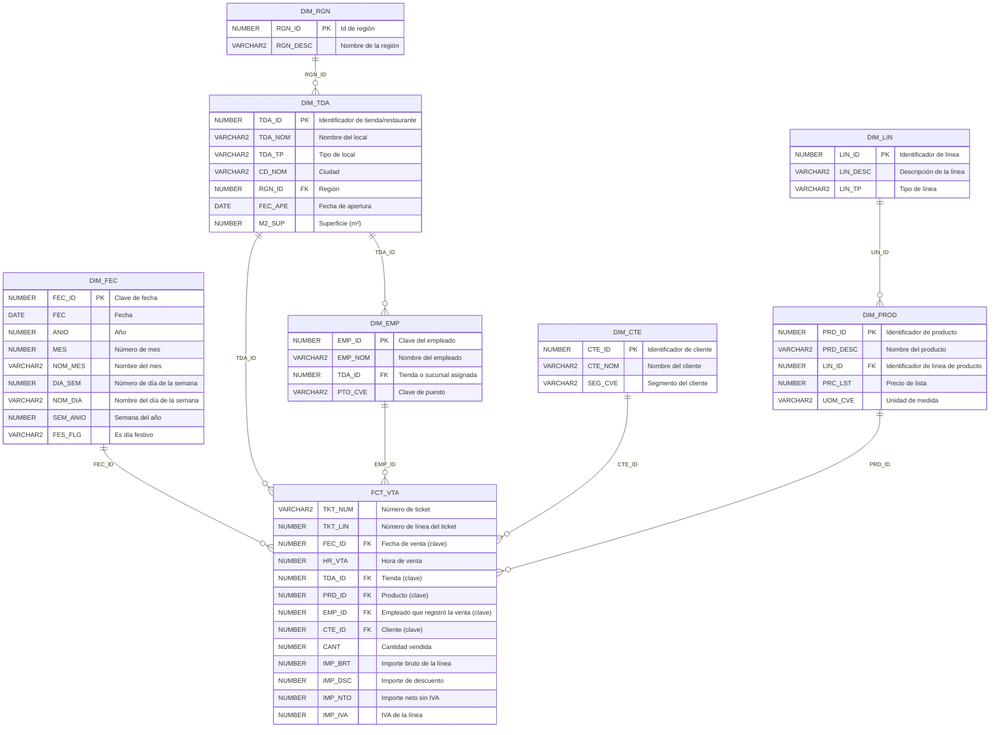

# Diagramas estrella

## FCT_DEV — Devoluciones

```mermaid
erDiagram
  DIM_FEC ||--o{ FCT_DEV : "FEC_ID"
  DIM_TDA ||--o{ FCT_DEV : "TDA_ID"
  DIM_PROD ||--o{ FCT_DEV : "PRD_ID"
  DIM_EMP ||--o{ FCT_DEV : "EMP_ID"
  DIM_MTV ||--o{ FCT_DEV : "MTV_CVE"
  DIM_TDA ||--o{ DIM_EMP : "TDA_ID"
  DIM_LIN ||--o{ DIM_PROD : "LIN_ID"
  DIM_RGN ||--o{ DIM_TDA : "RGN_ID"
  DIM_EMP {
    NUMBER EMP_ID PK "Clave del empleado"
    VARCHAR2 EMP_NOM "Nombre del empleado"
    NUMBER TDA_ID FK "Tienda o sucursal asignada"
    VARCHAR2 PTO_CVE "Clave de puesto"
  }
  DIM_FEC {
    NUMBER FEC_ID PK "Clave de fecha"
    DATE FEC "Fecha"
    NUMBER ANIO "Año"
    NUMBER MES "Número de mes"
    VARCHAR2 NOM_MES "Nombre del mes"
    NUMBER DIA_SEM "Número de día de la semana"
    VARCHAR2 NOM_DIA "Nombre del día de la semana"
    NUMBER SEM_ANIO "Semana del año"
    VARCHAR2 FES_FLG "Es día festivo"
  }
  DIM_LIN {
    NUMBER LIN_ID PK "Identificador de línea"
    VARCHAR2 LIN_DESC "Descripción de la línea"
    VARCHAR2 LIN_TP "Tipo de línea"
  }
  DIM_MTV {
    VARCHAR2 MTV_CVE PK "Clave del motivo"
    VARCHAR2 MTV_DESC "Descripción del motivo"
  }
  DIM_PROD {
    NUMBER PRD_ID PK "Identificador de producto"
    VARCHAR2 PRD_DESC "Nombre del producto"
    NUMBER LIN_ID FK "Identificador de línea de producto"
    NUMBER PRC_LST "Precio de lista"
    VARCHAR2 UOM_CVE "Unidad de medida"
  }
  DIM_RGN {
    NUMBER RGN_ID PK "Id de región"
    VARCHAR2 RGN_DESC "Nombre de la región"
  }
  DIM_TDA {
    NUMBER TDA_ID PK "Identificador de tienda/restaurante"
    VARCHAR2 TDA_NOM "Nombre del local"
    VARCHAR2 TDA_TP "Tipo de local"
    VARCHAR2 CD_NOM "Ciudad"
    NUMBER RGN_ID FK "Región"
    DATE FEC_APE "Fecha de apertura"
    NUMBER M2_SUP "Superficie (m²)"
  }
  FCT_DEV {
    NUMBER DEV_ID "Identificador de devolución"
    NUMBER FEC_ID "Fecha de la devolución"
    NUMBER HR_DEV "Hora de la devolución"
    NUMBER TDA_ID FK "Tienda"
    NUMBER PRD_ID FK "Producto"
    NUMBER EMP_ID FK "Empleado"
    VARCHAR2 TKT_ORIG "Ticket original"
    NUMBER CANT "Cantidad devuelta"
    NUMBER IMP_DEV "Importe devuelto"
    VARCHAR2 MTV_CVE "Clave de motivo de devolución"
  }
```

## FCT_INV — Inventario semanal por tienda y producto

```mermaid
erDiagram
  DIM_FEC ||--o{ FCT_INV : "FEC_ID"
  DIM_TDA ||--o{ FCT_INV : "TDA_ID"
  DIM_PROD ||--o{ FCT_INV : "PRD_ID"
  DIM_LIN ||--o{ DIM_PROD : "LIN_ID"
  DIM_RGN ||--o{ DIM_TDA : "RGN_ID"
  DIM_FEC {
    NUMBER FEC_ID PK "Clave de fecha"
    DATE FEC "Fecha"
    NUMBER ANIO "Año"
    NUMBER MES "Número de mes"
    VARCHAR2 NOM_MES "Nombre del mes"
    NUMBER DIA_SEM "Número de día de la semana"
    VARCHAR2 NOM_DIA "Nombre del día de la semana"
    NUMBER SEM_ANIO "Semana del año"
    VARCHAR2 FES_FLG "Es día festivo"
  }
  DIM_LIN {
    NUMBER LIN_ID PK "Identificador de línea"
    VARCHAR2 LIN_DESC "Descripción de la línea"
    VARCHAR2 LIN_TP "Tipo de línea"
  }
  DIM_PROD {
    NUMBER PRD_ID PK "Identificador de producto"
    VARCHAR2 PRD_DESC "Nombre del producto"
    NUMBER LIN_ID FK "Identificador de línea de producto"
    NUMBER PRC_LST "Precio de lista"
    VARCHAR2 UOM_CVE "Unidad de medida"
  }
  DIM_RGN {
    NUMBER RGN_ID PK "Id de región"
    VARCHAR2 RGN_DESC "Nombre de la región"
  }
  DIM_TDA {
    NUMBER TDA_ID PK "Identificador de tienda/restaurante"
    VARCHAR2 TDA_NOM "Nombre del local"
    VARCHAR2 TDA_TP "Tipo de local"
    VARCHAR2 CD_NOM "Ciudad"
    NUMBER RGN_ID FK "Región"
    DATE FEC_APE "Fecha de apertura"
    NUMBER M2_SUP "Superficie (m²)"
  }
  FCT_INV {
    NUMBER FEC_ID FK "Fecha de corte (semana)"
    NUMBER TDA_ID FK "Tienda"
    NUMBER PRD_ID FK "Producto"
    NUMBER EXIST_CANT "Existencia (cantidad en inventario)"
    NUMBER CST_UNIT "Costo unitario"
  }
```

## FCT_VTA — Ventas detalle por ticket

```mermaid
erDiagram
  DIM_FEC ||--o{ FCT_VTA : "FEC_ID"
  DIM_TDA ||--o{ FCT_VTA : "TDA_ID"
  DIM_PROD ||--o{ FCT_VTA : "PRD_ID"
  DIM_EMP ||--o{ FCT_VTA : "EMP_ID"
  DIM_CTE ||--o{ FCT_VTA : "CTE_ID"
  DIM_TDA ||--o{ DIM_EMP : "TDA_ID"
  DIM_LIN ||--o{ DIM_PROD : "LIN_ID"
  DIM_RGN ||--o{ DIM_TDA : "RGN_ID"
  DIM_CTE {
    NUMBER CTE_ID PK "Identificador de cliente"
    VARCHAR2 CTE_NOM "Nombre del cliente"
    VARCHAR2 SEG_CVE "Segmento del cliente"
  }
  DIM_EMP {
    NUMBER EMP_ID PK "Clave del empleado"
    VARCHAR2 EMP_NOM "Nombre del empleado"
    NUMBER TDA_ID FK "Tienda o sucursal asignada"
    VARCHAR2 PTO_CVE "Clave de puesto"
  }
  DIM_FEC {
    NUMBER FEC_ID PK "Clave de fecha"
    DATE FEC "Fecha"
    NUMBER ANIO "Año"
    NUMBER MES "Número de mes"
    VARCHAR2 NOM_MES "Nombre del mes"
    NUMBER DIA_SEM "Número de día de la semana"
    VARCHAR2 NOM_DIA "Nombre del día de la semana"
    NUMBER SEM_ANIO "Semana del año"
    VARCHAR2 FES_FLG "Es día festivo"
  }
  DIM_LIN {
    NUMBER LIN_ID PK "Identificador de línea"
    VARCHAR2 LIN_DESC "Descripción de la línea"
    VARCHAR2 LIN_TP "Tipo de línea"
  }
  DIM_PROD {
    NUMBER PRD_ID PK "Identificador de producto"
    VARCHAR2 PRD_DESC "Nombre del producto"
    NUMBER LIN_ID FK "Identificador de línea de producto"
    NUMBER PRC_LST "Precio de lista"
    VARCHAR2 UOM_CVE "Unidad de medida"
  }
  DIM_RGN {
    NUMBER RGN_ID PK "Id de región"
    VARCHAR2 RGN_DESC "Nombre de la región"
  }
  DIM_TDA {
    NUMBER TDA_ID PK "Identificador de tienda/restaurante"
    VARCHAR2 TDA_NOM "Nombre del local"
    VARCHAR2 TDA_TP "Tipo de local"
    VARCHAR2 CD_NOM "Ciudad"
    NUMBER RGN_ID FK "Región"
    DATE FEC_APE "Fecha de apertura"
    NUMBER M2_SUP "Superficie (m²)"
  }
  FCT_VTA {
    VARCHAR2 TKT_NUM "Número de ticket"
    NUMBER TKT_LIN "Número de línea del ticket"
    NUMBER FEC_ID FK "Fecha de venta (clave)"
    NUMBER HR_VTA "Hora de venta"
    NUMBER TDA_ID FK "Tienda (clave)"
    NUMBER PRD_ID FK "Producto (clave)"
    NUMBER EMP_ID FK "Empleado que registró la venta (clave)"
    NUMBER CTE_ID FK "Cliente (clave)"
    NUMBER CANT "Cantidad vendida"
    NUMBER IMP_BRT "Importe bruto de la línea"
    NUMBER IMP_DSC "Importe de descuento"
    NUMBER IMP_NTO "Importe neto sin IVA"
    NUMBER IMP_IVA "IVA de la línea"
  }
```
